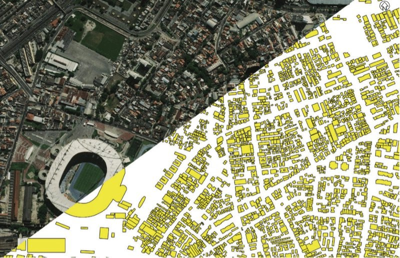
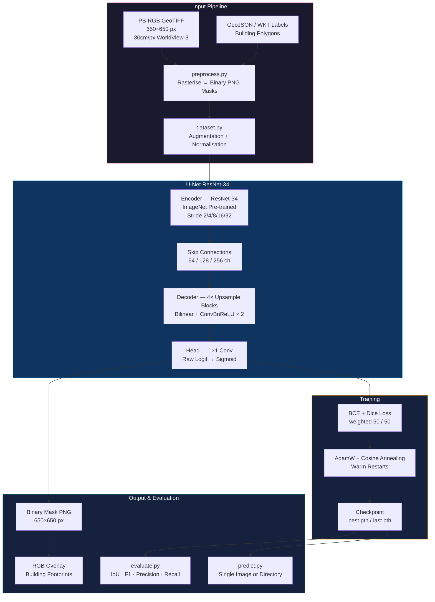
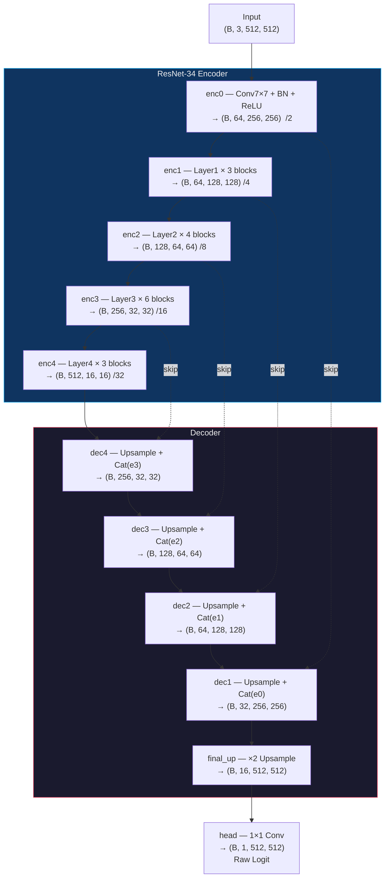
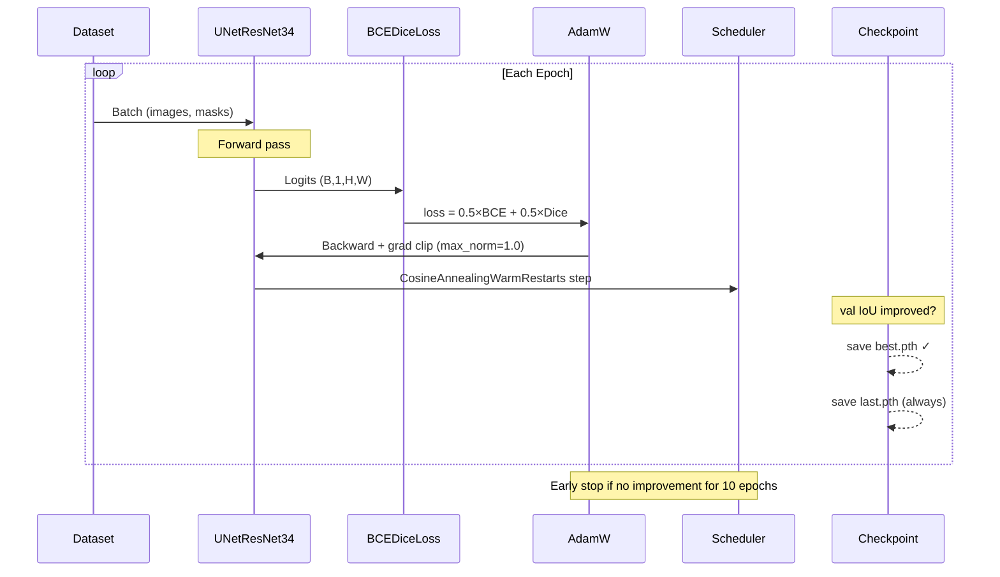

<p align="center">

</p>
#  SpaceNet AOI_2_Vegas — Building Detection & Segmentation

<p align="center">

<!-- Language -->


<!-- Deep Learning -->


<!-- Models -->


<!-- Dataset -->


<!-- Libraries -->


<!-- Tools -->


<!-- OS -->


</p>


### Detect and segment building footprints from satellite imagery using U-Net + ResNet-34.

> *"Feed it a satellite image. Get back precise building footprints."*

## The Problem

Mapping buildings from satellite imagery at scale is one of the most impactful challenges in geospatial AI. Manual digitization is slow, expensive, and inconsistent. Traditional computer vision approaches rely on hand-crafted features that fail across diverse urban environments — different roof colors, building densities, lighting conditions, and image resolutions.

**There is no simple rule-based system that can reliably segment buildings across thousands of satellite images.**

## The Solution

This project trains a **U-Net with a ResNet-34 encoder** on the SpaceNet AOI_2_Vegas dataset — 3,849 WorldView-3 pan-sharpened RGB images of Las Vegas at 30cm resolution. The model learns to produce pixel-accurate binary segmentation masks (building vs. background) directly from raw satellite imagery.

The encoder is pre-trained on ImageNet and fine-tuned end-to-end. The decoder reconstructs full-resolution masks through skip connections, preserving fine-grained spatial detail lost during downsampling.

---

## System Architecture



---

## Model Architecture — Deep Dive



**Total trainable parameters: ~24.4M** (encoder ~21.3M + decoder ~3.1M)

---

## Training Pipeline



---

## Dataset

| Property | Value |
|----------|-------|
| Source | SpaceNet Challenge 2 — AOI_2_Vegas |
| Sensor | WorldView-3 Pan-Sharpened RGB |
| Resolution | 30 cm/px |
| Image size | 650 × 650 px |
| Total images | 3,849 |
| Train split | 3,271 (85%) |
| Val split | 578 (15%) |
| Label format | GeoJSON polygon / WKT pixel coordinates |
| Mask encoding | Binary PNG — 255 = building, 0 = background |

---

## Training Results

| Epoch | Train Loss | Train IoU | Val Loss | Val IoU | Val F1 |
|-------|-----------|-----------|----------|---------|--------|
| 1 | 0.2686 | 0.6141 | 0.1857 | 0.7220 | 0.8366 |
| 2 | 0.2039 | 0.6950 | 0.1414 | 0.7836 | 0.8777 |
| … | … | … | … | … | … |

Best checkpoint saved to `checkpoints/best.pth` whenever val IoU improves.

---

## Project Structure

```
building_detection/
├── preprocess.py          # GeoJSON/WKT → binary PNG masks + train/val split
├── dataset.py             # PyTorch Dataset with albumentations augmentation
├── model.py               # U-Net with ResNet-34 encoder
├── train.py               # Training loop — BCE+Dice, AdamW, cosine schedule
├── evaluate.py            # Val metrics (IoU, F1, precision, recall) + visualisations
├── predict.py             # Inference on single image or directory
├── requirements.txt       # Python dependencies
│
├── data/
│   ├── masks/             # Generated binary masks (mask_imgN.png)
│   ├── train.txt          # Image IDs for training
│   └── val.txt            # Image IDs for validation
│
├── checkpoints/
│   ├── best.pth           # Best validation IoU checkpoint
│   └── last.pth           # Most recent epoch checkpoint
│
├── logs/
│   ├── history.json       # Per-epoch metrics
│   └── events.out.*       # TensorBoard event files
│
└── outputs/
    └── vis/               # Side-by-side visualisations from evaluate.py
```

---

## Augmentation Strategy

Training augmentations applied via `albumentations`:

| Transform | Probability | Purpose |
|-----------|------------|---------|
| RandomCrop 512×512 | 1.0 | Fits 650×650 images to network input |
| HorizontalFlip | 0.5 | Rotation invariance |
| VerticalFlip | 0.5 | Rotation invariance |
| RandomRotate90 | 0.5 | Rotation invariance |
| RandomBrightnessContrast | 0.4 | Sensor/lighting variation |
| GaussNoise | 0.3 | Sensor noise robustness |
| Normalize (ImageNet) | 1.0 | Match pre-trained encoder statistics |

Validation: CenterCrop 512×512 + Normalize only.

---

## Loss Function

Combined **BCE + Dice** loss weighted equally:

```
L = 0.5 × BCE(logits, targets) + 0.5 × Dice(sigmoid(logits), targets)
```

BCE handles per-pixel classification. Dice directly optimises the overlap metric and handles class imbalance (buildings occupy < 20% of pixels on average).

---

## Setup & Usage

### Prerequisites

- Python 3.10+
- macOS / Linux
- conda (recommended) or virtualenv

### 1. Install dependencies

```bash
conda activate amitchauhanai
pip install -r requirements.txt
```

### 2. Generate masks and splits

```bash
cd /Users/amitchauhanai/SpaceNet/AOI_2_Vegas/building_detection

python preprocess.py \
  --rgb_dir     ../dataset/PS-RGB \
  --geojson_dir ../dataset/geojson_buildings \
  --mask_dir    data/masks \
  --split       0.85 \
  --seed        42
```

Output:
```
Found 3849 PS-RGB images.
  [3849/3849] 100%  last: img998
Done.
  Total processed : 3849
  Train           : 3271
  Val             : 578
  Errors skipped  : 0
```

### 3. Train the model

```bash
python train.py \
  --rgb_dir   ../dataset/PS-RGB \
  --mask_dir  data/masks \
  --data_dir  data \
  --out_dir   . \
  --epochs    50 \
  --batch     8 \
  --img_size  512 \
  --workers   0 \
  --lr        3e-4 \
  --patience  10
```

Resume from checkpoint:
```bash
python train.py ... --resume checkpoints/last.pth
```

### 4. Evaluate

```bash
python evaluate.py \
  --checkpoint checkpoints/best.pth \
  --rgb_dir    ../dataset/PS-RGB \
  --mask_dir   data/masks \
  --val_txt    data/val.txt \
  --out_dir    outputs \
  --vis_n      20
```

Outputs `outputs/eval_results.json` and up to 20 PNG visualisations in `outputs/vis/`.

### 5. Predict on new images

```bash
# Single image
python predict.py \
  --checkpoint checkpoints/best.pth \
  --input      ../dataset/PS-RGB/SN2_buildings_train_AOI_2_Vegas_PS-RGB_img1.tif

# Whole directory
python predict.py \
  --checkpoint checkpoints/best.pth \
  --input      ../dataset/PS-RGB \
  --pattern    "*PS-RGB*.tif" \
  --out_dir    outputs/predictions \
  --save_prob
```

Each image produces:
- `<stem>_mask.png` — binary segmentation mask (0/255)
- `<stem>_overlay.png` — RGB image with building footprints overlaid in red
- `<stem>_prob.png` — probability heatmap (0–255), if `--save_prob`

---

## Hardware Notes

| Device | Batch Size | Workers | Epoch Time |
|--------|-----------|---------|------------|
| Apple MPS (M-series) | 8 | 0 | ~9 min |
| NVIDIA GPU (A100) | 16 | 4 | ~2 min |
| CPU | 4 | 0 | ~60 min |

On Apple Silicon, set `--workers 0` — MPS does not support `pin_memory` or multiprocessing DataLoader workers reliably.

---

## Tech Stack

| Component | Technology | Purpose |
|-----------|-----------|---------|
| Deep Learning | PyTorch 2.x | Model, training loop, inference |
| Encoder | torchvision ResNet-34 | ImageNet pre-trained feature extraction |
| Augmentation | albumentations 2.x | Spatial and photometric augmentation |
| Raster I/O | rasterio + GDAL | GeoTIFF read with CRS-aware transforms |
| Geo Processing | shapely + pyproj | GeoJSON polygon handling and reprojection |
| Image I/O | Pillow + tifffile | PNG mask write/read |
| CV fallback | opencv-python | Polygon rasterisation fallback |
| Logging | TensorBoard | Loss and IoU curves |
| Hardware | Apple MPS / CUDA | GPU-accelerated training |

---

## Why U-Net + ResNet-34?

**U-Net** was designed for biomedical image segmentation — a domain with the same challenges as building detection: small training sets, need for pixel-precise output, and objects at multiple scales. The encoder-decoder structure with skip connections preserves both semantic context (from deep layers) and fine spatial detail (from shallow layers).

**ResNet-34** as the encoder gives us:
- Residual connections that enable training of deep networks without degradation
- ImageNet pre-training — 1.2M images of natural scene understanding transfer well to satellite imagery
- A proven 34-layer depth that balances capacity against overfitting risk on a 3,271-image dataset

The combination achieves SpaceNet-competitive IoU scores in a single training run with no ensembling or test-time augmentation.

---

## References

- [SpaceNet Challenge 2 — Building Footprint Extraction](https://spacenet.ai/spacenet-buildings-dataset-v2/)
- [U-Net: Convolutional Networks for Biomedical Image Segmentation](https://arxiv.org/abs/1505.04597) — Ronneberger et al., 2015
- [Deep Residual Learning for Image Recognition](https://arxiv.org/abs/1512.03385) — He et al., 2015
- [WorldView-3 Satellite Imagery](https://www.maxar.com/products/worldview-3) — Maxar Technologies

---

<p align="center">
  <b>Pixel-accurate building footprints from satellite imagery — no hand-crafted features, no DOM parsing, just vision.</b>
</p>
# Building-Footprints
# Building_Footprints_SpaceNet
